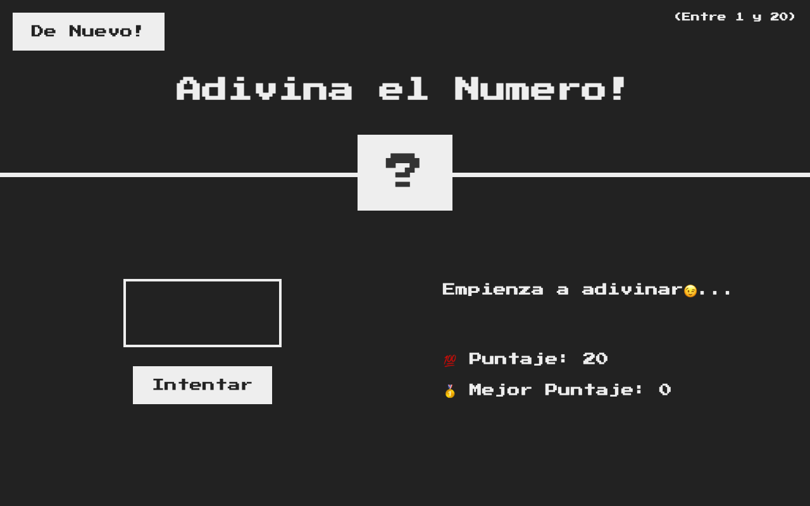

<p align="center">
  <b>🎯 Adivina el Número</b><br>
  <sub>El clásico juego de adivinar un número secreto del 1 al 20 — mi primer proyecto en JavaScript.</sub>
</p>

<p align="center">
  
</p>

<p align="center">
  <a href="https://anthoniriv.github.io/adivinaelnumero/"></a>
  
  
  
  
</p>

---

## Qué hace

La máquina elige un número secreto entre **1 y 20** y vos tenés que adivinarlo. Cada intento fallido te resta un punto y te dice si te quedaste corto o te pasaste. Ganas cuando acertás, con la mayor puntuación posible.

## Funcionalidades

- Número secreto aleatorio entre 1 y 20.
- Pista de «más alto» / «más bajo» en cada intento fallido.
- Puntaje inicial de **20** que baja con cada fallo.
- **Récord** que se mantiene durante la sesión.
- Feedback visual al ganar (la pantalla se pone verde y muestra el número).
- Cero dependencias: HTML, CSS y JavaScript puro.

## Jugar

**[anthoniriv.github.io/adivinaelnumero](https://anthoniriv.github.io/adivinaelnumero/)** · [Ver código](https://github.com/anthoniriv/adivinaelnumero)

## Uso local

No necesita build. Abrí `index.html` en el navegador o serví la carpeta:

```bash
npx serve .
```

## Tecnologías

| Capa | Stack |
|------|-------|
| Lógica | JavaScript (vanilla) |
| Estructura | HTML5 |
| Estilos | CSS3 |

---

<p align="center"><sub>Hecho con ❤️ por <a href="https://github.com/anthoniriv">Anthoni Rivera</a></sub></p>
